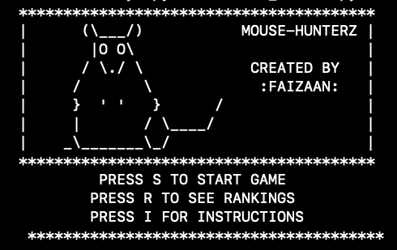
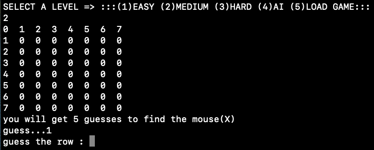
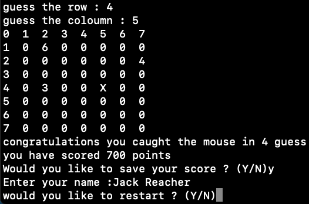

## Project Name : Mouse Hunter  
A Grid - Based Game

## Languages
Python3

## Game Description 
A Python 3 game called Mouse Hunter. In the game a hunter tries to
catch a mouse who is hiding on a square grid. In each round the hunter guesses a square
and are told the distance from the mouse. The distance is the number of vertical and
horizontal steps to reach it (we do not move diagonally). 

## Extensions to the game
* An option to change the number of lives.
* An option to play again at the end.
* An option to save the game midway for completion later.
* An option to change the grid size.
* An option for a reversed game mode: where the user hides the mouse and the computer guesses where it is.

## Setup 
1. Clone Repository
2. Navigate to  /MouseHunter/Main
3. Run Mouse_hunter.py 
```
python3 Mouse_hunter.py
```

## Demo

###### **Start Game**



###### **User Selection**



######  **End game & Restart option**


